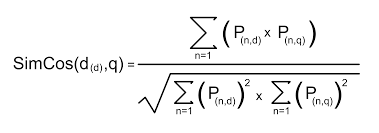

# Moogle

## Documentación del Codigo Solución

> Proyecto de Programación I. 
>Facultad de Matemática y Computación. Universidad de La Habana. Curso 2022.
>
>Dev: Alfredo Nuño Oquendo C122

# Aspectos de la aplicación


**Moogle!** es un buscador desarrollado con .Net Core 6.0 usando Blazor como Framework de interfás gráfica.
El obetivo de este buscador es poder realizar consultas de tipo texto en un conjunto de documentos.

## Modelo Vectorial

Para realizar las consultas y mostrar los resultados, la aplicación usa el **Modelo Vectorial**.

Este se basa en analizar los documentos como vectores y calcular su semejanza con la query, también tomada como vector.

Las palabras se toman por su peso en el documento en el que aparecen *term frecuency* (**TF**) y su peso a nivel de todos los documentos *inverse document frecuency* (**IDF**).

El **TF** es la cantidad de veces que aparece la palabra en el documento y el **IDF** es el `log10(N+1/n)` donde `N` es la cantidad de documentos totales y `n` es la cantidad de documentos en el que aparece la palabra.

La similitud coseno se calcula de la siguiente forma:




## Explicación General

La aplicacion esta dividida en dos grandes Componentes:

- `MoogleServer:` es un servidor web que renderiza la interfaz gráfica y sirve los resultados.
- `MoogleEngine:` contiene toda la logica que usa la aplicación para realizar las busquedas.

### Implentación MoogleEngine

Este componente cuenta con 7 clases que contienten los algoritmos necesarios para realizar las consultas:

- **SearchItems:** Contiene la información de la busqueda de un documento que va a ser renderizado.
- **SearchResult:** Contiene una lista de `SearchItems` y una sugerencia de consulta para mostrar en los resultados.
- **Moogle:** En ella aparece un metodo Query, el cual tendrá todo el proceso( apoyándose de las demás clases) desde que se recibe la query hasta que se mandan los resultados para renderizarlos.
- **dataBase_Manage:** En esta clase se cargarán los documentos y mediante ella se podrá acceder a sus contenidos.
- **Doc:** Establece de qué forma el Moogle asimilará los documentos y contiene a nivel de documento: `title`, `score` ( relevancia del documento respecto a la query), `Snipet` ( mejor fragmento a mostrar del documento ).
- **Operators:**  Contiene métodos relacionados a los operadores de búsqueda: `existencia`, `no existencia`, `importancia`, `cercanía`
- **VectorialModel:** Esta clase está formada por los métodos que se emplean en lo referente a modelo vectorial (cálculo del **IDF** de cada palabra y la *similitud coseno* de cada documento respecto a la query).

Para mayor información sobre los métodos y sus funciones haga [click aquí](./class_and_methods.md).

### Procesamiento de las palabras por documento

Al establecer el usuario un criterio de búsqueda (query):
- Se instancia la clase 'dataBase_Manage' la cual crea una lista de documentos tipo 'Doc'.

    ```cs
    List<Doc> documents;
    ```
- En esa misma clase se guarda el **IDF** de las palabras de todos los documentos (para posteriormente calcular el **TFxIDF**) en:
    
    ```cs
    Dictionary<string, float> total_words;
    ```

- Cada elemento tipo Doc calcula el **TF** de sus palabras y luego usa total_words para calcular el **TFxIDF** de sus palabras y lo almacena en:

    ```cs
    Dictionary<string, float> TFxIDF;
    ```

### Procesamiento de la query

- El criterio de búsqueda del usuario (query) es pasado como parámetro en el método `Query` de la clase `Moogle`, y mediante el constructor de la clase `Doc`:

    ```cs
    public Doc(string doc)
    {
        text = Operators.QueryOperators(doc, characters_query);
        words_Snippet = doc.Split(characters, StringSplitOptions.RemoveEmptyEntries);

        //poner las palabras en minusculas
        for (int i = 0; i < words_Snippet.Length; i++)
        {
            words_Snippet[i] = words_Snippet[i].ToLower();
        }

        TFxIDF = new Dictionary<string, float>();
        fillwords();
    }
    ```
    Donde doc es la query, es instanciada y como pertenece a la clase `Doc` guarda el **TFxIDF** de sus palabras en:

    ```cs
    Dictionary<string, float> TFxIDF;
    ```
- Ademas, de la misma forma que los documentos guardan sus palabras (tal y como aparecen en el texto junto a sus signos de puntuación para la posterior construcción de la Snippet), se guardan las palabras de la query con sus respectivos operadores en:
    
    ```cs
    List<string> text;
    ```

### Operadores

Cuando un usuario va a realizar una búsqueda, este puede hacer uso de varios operadores para hacer que la búsqueda sea más personalizada:

- **Operador de no existencia:** Un símbolo `!` delante de una palabra (e.j., `"algoritmos de búsqueda !ordenación"`) indica que esa palabra **no debe aparecer** en ningún documento que sea devuelto.
- **Operador de existencia:** Un símbolo `^` delante de una palabra (e.j., `"algoritmos de ^ordenación"`) indica que esa palabra **tiene que aparecer** en cualquier documento que sea devuelto.
- **Operador de cercanía:** Un símbolo `~` entre dos o más términos indica que esos términos deben **aparecer cerca**, o sea, que mientras más cercanos estén en el documento mayor será la relevancia. Por ejemplo, para la búsqueda `"algoritmos ~ ordenación"`, mientras más cerca están las palabras `"algoritmo"` y `"ordenación"`, más alto debe ser el `score` de ese documento.
- **Operador de relevancia:** Cualquier cantidad de símbolos `*` delante de un término indican que ese término es más importante, por lo que su influencia en el `score` debe ser mayor que la tendría normalmente (este efecto será acumulativo por cada `*`, por ejemplo `"algoritmos de **ordenación"` indica que la palabra `"ordenación"` tiene dos veces más prioridad que `"algoritmos"`).

#### **Uso correcto de los operadores**
Los operadores `!`, `*` y `^` deben ubicarse antes y junto a la palabra que afecten (e.j., `"^algoritmos de búsqueda !ordenación"`) y el operador de cercanía debe ir solo uno entre dos palabras, sin embargo al efectuar la búsqueda (e.j., `"recursividad~ palabras ~ ciclos"`) el algoritmo correspondiente buscará en los documentos qué tan cerca aparecen las tres palabras, sin importar en que orden las haya escrito el usuario


#### **Cálculo de los operadores**

Los operadores afectan directamente el **score** de cada documento de la siguiente manera:

- Los operadores de existencia o no de una determinada palabras lo anulan en caso que el documento en cuestion incumpla con su condicion.

- El operador de importancia lo multiplica por `2^n` siendo `n` el número de veces que haya escrito el usuario el operador `*` en la palabra en cuestión siempre que esta aparezca en el documento que se analiza 

- El operador de cercanía entre varias palabras afecta el **score** multiplicándolo por `10/near` siendo `near` la distancia mínima entre esas palabras en el documento o anulándolo en caso de que al menos una de estas no aparezca

### Cálculo del Snippet

A los documentos que luego de calcular la `similitud coseno` y efectuar los cálculos con los operadores, resulten tener un score distinto de cero se les calcula la mejor Snippet de la siguiente forma:

- Cada documento tipo Doc contiene entre sus propiedades:

    ```cs
    string[] words_snippet;
    ```

- En la cual se guardan solo las palabras del documento en el orden en que aparecen en el texto y sin signos de puntuacion, este array se recorre con un rango de 100 palabras y de cada fragmento se escoje el que más palabras con un **IDF** alto tenga ( palabras relevantes a nivel de todos los documentos ).

### Calculo de la sugerencia

En la clase `Moogle` encontramos el método `Levenshtein` el cual utiliza el algoritmo que le da nombre, a través del método `LevenshteinDistance` y calcular la menor cantidad de cambios que hay que hacer para igualar una palabra a otra.

A través del diccionario `total_words` que guarda todas las palabras de todos los documentos, este método compara una por una las palabras y devuelve la más parecida a cada palabra de la query

